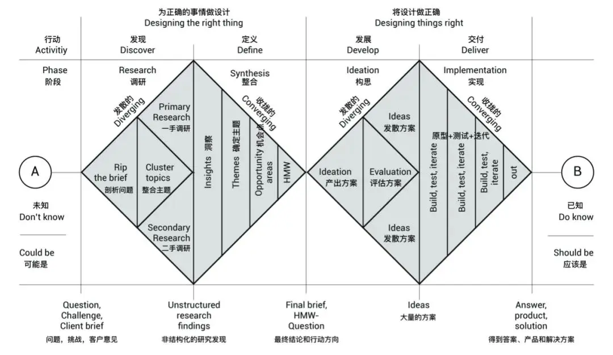

# 第一章：认知唤醒与问题洞察

> 建立对"AI时代设计价值"的认知，掌握双钻模型，完成从"模糊痛点"到"清晰问题定义"的收敛。

---

## 1.1 设计的价值

当看到一件产品时，人们最先感知到的往往是它的外观。随着了解不断深入，会逐渐发现产品背后存在大量关于行为、需求、环境与体验的思考。设计活动连接着人与产品之间的关系。这种关系既体现在功能实现上，也体现在使用感受、行为习惯以及环境适应等方面。理解设计的价值，有助于在后续研究过程中建立判断依据。在面对问题时，能够知道为什么需要研究它；在面对方案时，也能够知道为什么选择它。

### 1.1.1 问题发现与解决价值

设计脱离对产品外观美化的刻板印象，通过对功能、结构、技术、成本等平衡，来解决人、社会、生态等问题，以产品角度来看待，用户作为核心设计对象，那所产出的产品就要不仅"能用"，更要"好用"。

因此，设计本质上是一种**系统化的问题解决方式**。

### 1.1.2 用户体验创造价值

随着产品功能逐渐趋同，设计开始更多关注用户的情绪体验与感知体验。设计会影响用户对于产品的情绪、感受、审美、认知、心理体验、情感连接等。

因此，设计是从**创造"物"上延伸到创造人与产品之间的体验关系**。

### 1.1.3 未来生活方式探索价值

设计不仅服务于当下需求，同时也在探索未来人与技术、人与环境之间的新关系。

随着AI技术、智能硬件、数字工作流、移动办公的发展，设计正在不断推动新的生活方式形成。

因此设计不仅是产品开发过程的一部分，更是**对未来社会与未来生活方式的探索**。

**💭 思考问题**

"你认为设计工作与艺术创作的根本区别是什么？设计的'边界'在哪？"

---

## 📝 学习者任务一：体验记录

**任务**：请回忆你最近一周内，使用某个智能硬件产品时**最差体验**的一个，说明问题来源。

**产出格式要求**（必须使用以下句式）：

> "当我在【场景】使用【产品名称】的【具体功能】时，我感到【情绪词汇】，因为【分析原因】。"

**示范**：

> "当我在深夜赶项目用普通键盘连续打字3小时后，我感到手指酸痛且注意力下降，因为键盘没有根据我的使用时长提供任何疲劳提醒或交互节奏变化。"

---

## 1.2 双钻模型介入

经过前面的观察与记录，可以发现问题往往以分散的形式出现。有些问题来自操作过程，有些问题来自使用体验，也有些问题来自环境变化。由于这些信息彼此之间并没有形成明确结构。因此需要一种方法帮助整理和组织已经获得的信息。而双钻模型就提供了一种从发散到收敛的工作路径。当前阶段所完成的体验记录属于第一个钻石中的"发现"部分，课程后续内容将围绕这一框架展开。

双钻模型（由Design Council提出）提供了一种从发散到收敛的系统化工作路径。模型包含四个阶段：发现、定义、发展和交付。本课程聚焦于第一个钻石（问题空间），即从"发现"问题到"定义"清楚问题。核心理念在于"做正确的事"，即首先学会提出正确的问题，而非直接跳入解决方案。

图片来源于网络

在双钻模型中，每一个钻石都经历一次发散与收敛。发散意味着尽可能扩大观察范围，收敛意味着从大量信息中寻找重点。

整个课程将围绕四个阶段展开：发现（Discover）、定义（Define）、发展（Develop）、交付（Deliver）

**声明**：本课程聚焦于第一次发散与收敛（从"问题空间"到"产品定义"）

当前课程所处的位置，正位于第一个钻石的起点。

此时最重要的工作并不是寻找解决方案，而是尽可能发现值得关注的问题。

**核心理念**：

> "设计是从学会提出正确的问题开始的-做正确的事。"

**💭 思考问题**

"何为正确的事？""你认为用此模型进行产品产出的优势与局限在哪？"

---

## 1.3 问题提出

这部分是双钻模型，也是进行产品0-1产出的起点，常考察的是共情力与洞察力，发现个人、集体、社会甚至生态中存在的问题，而本阶段可以先尝试从自身经历入手，从记录的现象中寻找那些反复出现、影响明显且具有持续性的问题。一个能够被持续观察和研究的具体问题，往往比宏大的命题更适合作为设计起点。关键在于将模糊的"不便"转化为清晰的"问题陈述"。

本课程以**Vibe Coding键盘**为贯穿案例，探讨在真实场景下的痛点，推导出产品的产出对于具体问题所具有的指向性，梳理从0-1的产品逻辑链。Vibe Coding键盘来源于数字创作场景中的工作流观察，随着软件切换、快捷操作、参数调整以及AI工具调用等行为频繁发生，一些传统输入设备暴露出与新型创作场景不匹配的问题开始逐渐显现，传统键盘无法满足快捷操作和打断工作心流等需求。这些真实经历中的不便，最终被提炼为"如何减少创作过程中的工具切换成本"这一核心问题。

对于每位学习者而言，设计课题同样应该来源于在创作过程中的真实经历，能够持续观察、持续研究的问题，往往比宏大的命题更适合作为设计起点。

---

## 📝 学习者任务二：痛点发散

**任务**：在自己的创作或工作场景（编程、写作、策划、设计等）中，记录至少5个具体痛点，从人-物-事-时-境出发。

**产出格式**：

> "【人】在【时间】下的【场景】中，当需要做【某件事】时，我需要【X步操作】，这打断了我因为【Y原因】。"

**示范**：

> "我在下午2点于杂乱的工位写代码时，想调用AI解释一段报错，我需要：'选中代码→右键→选择"Ask AI"→等待→复制结果→粘贴。这打断了我，因为需要完全切换手部位置和注意力。'"

**建议**：使用便利贴、思维导图或白板形式完成，每一点尽可能清晰详细，最好能够表达自己情绪与状态的转变。

产出结果应能够清晰展示问题来源于哪些场景；哪些问题出现频率较高；哪些问题可能指向同一个设计机会。

---

## 1.4 选项确认

经过痛点发散与问题提炼，我们可能已经识别出多个值得关注的问题。但设计资源有限，无法同时解决所有问题。因此，需要对每个核心痛点进行独立的选项确认——即针对某一个具体的核心痛点，系统性地评估其设计价值、可行性与预期成果，形成一份结构化的选项确认表。

一个选项确认表仅对应一个核心痛点。它的作用是将抽象的"问题感觉"转化为可执行的设计课题，确保后续的竞品分析、概念生成与方案设计都围绕这个明确的痛点展开。

### 选项确认表核心要素

| 要素 | 说明 |
|------|------|
| 选项名称 | 清晰描述该选项所要解决的核心痛点，建议12字以内 |
| 问题背景 | 对问题背景现状进行描述，同时进行重要性归纳（探索社会上是否还有这样的痛点） |
| 目标人群 | 可根据自己的工作性质、对应的职业进行界定 |
| 预期成果 | 设计方案的具体形式（产品/服务/系统等） |
| 目的与价值 | 在于解决这一痛点问题能够实现/解决/达成/增效...聚焦功能、可用性（效率、效果、易用性等）或情感化（趣味、美感、愉悦等） |
| 其他说明 | 补充信息，可说明选项边界（可选填） |

完成选项确认表，意味着从"发现问题"正式迈入"定义问题"阶段，为后续的竞品分析、概念生成和方案设计奠定清晰的基础。

### 示例：Vibe Coding键盘选项确认表

| 要素 | 说明 |
|------|------|
| 选项名称 | 语音输入的唤醒问题 |
| 问题背景 | 我自己在日常打字时，经常想用语音输入快速记录想法。但当前使用的普通键盘没有内置麦克风，我只能腾出手去拿桌上的独立麦克风或对着笔记本自带麦克风说话，距离远、识别差。更麻烦的是，语音功能需要手动点击屏幕上的"开始语音"按钮，或者按下特定的组合（Win+H），容易打断心流状态。有一次我在安静环境下想用语音输入一段200字的笔记，结果因为识别准确率与注意力切换问题，折腾了1分钟最终放弃打字。这种情况每周至少发生5-6次，让我对语音功能产生了"麻烦不如打字"的抵触心理。 |
| 目标人群 | 经常需要快速记录灵感、不愿频繁切换输入方式的文字工作者（如写作者、学生、记者）；次要目标用户：对传统打字感到疲劳的用户。 |
| 预期成果 | 在键盘上集成一个专用语音按键（带物理防误触设计），一键唤醒系统语音输入，并内置高灵敏麦克风阵列，实现"按下即说、松开即停"的流畅体验。无需离开键盘、无需点击屏幕。 |
| 目的与价值 | 提升语音输入的使用意愿与效率，让用户真正享受到"说话比打字快"的便利。减少因心流打断导致的工具弃用现象，使键盘从单纯的输入工具转变为更自然的交互界面。 |
| 其他说明 | 需兼容Windows/macOS原生语音输入及第三方语音转文字软件。 |

---

## 📝 学习者任务三：选项确认表

**任务**：为你的五项核心痛点完成各一份选项确认表

**产出**：五份选项确认表

---

## 🔧 工具卡1：课题定义书（完整模板）

| 要素 | 内容 |
|------|------|
| **课题名称** | [清晰描述课题，建议12字以内] |
| **问题背景** | [描述问题现状及重要性] |
| **目标人群** | [界定目标用户群体] |
| **预期成果** | [设计方案的具体形式] |
| **目的与价值** | [解决痛点能实现的价值] |
| **其他说明** | [补充信息或边界说明（可选）] |

---

## 1.5 竞品分析

当问题被明确提出后，需要了解它在现实世界中的现状：是否已有解决方案？它们是如何回应的？有哪些不足？竞品分析不仅是观察产品，更是理解产品背后的设计决策，从而发现未被满足的需求地带，为自己的设计定位找到依据。

> "是否已经有人尝试解决过类似问题？现有产品采用了什么方式回应这些需求？哪些内容被保留了下来？哪些内容仍然存在不足？"

这些问题都能够通过竞品分析获得线索。

对于设计活动而言，竞品分析不仅是在观察产品，更是在观察产品背后的设计决策。课程案例中的Vibe Coding键盘同样经历了这一过程。

### 1.5.1 目的

了解市场上有哪些类型的产品在解决"创作输入/交互"相关的问题，建立分类框架，发现未被满足的需求地带。

### 1.5.2 分析方法

**方法**：竞品分类框架 + 特征提取

**分析维度**：产品定位、功能特性、用户体验、视觉设计、商业模式

---

## 📝 学习者任务四：探索性竞品分析

**任务**：在痛点发散后，完成探索性竞品分析表。

**产出**：探索性竞品分析表（总共至少5个竞品）

---

## 🔧 工具卡2：竞争对手档案分析框架

| 维度 | 分析要点 | 示例问题 |
|------|----------|----------|
| **产品定位** | 产品的核心价值主张 | 它解决什么问题？为谁解决？ |
| **功能特性** | 主要功能和特色 | 有哪些核心功能？哪些功能缺失？ |
| **用户体验** | 使用流程和感受 | 体验是否流畅？有哪些痛点？ |
| **视觉设计** | 界面风格和视觉语言 | 设计风格如何？是否符合品牌调性？ |
| **商业模式** | 盈利方式和定价策略 | 如何赚钱？价格定位如何？ |

---

## 1.6 问题收敛

通过前期的痛点发散、选项确认与竞品分析，我们已经积累了大量的信息：多个痛点场景、一份针对核心痛点的选项确认表、以及竞品分析中的优劣对比。此时，信息是发散的，需要对其进行收敛——即从多个可能的方向中，聚焦到一到两个最值得深入设计的核心问题。

问题收敛的常用工具有两种：

### 1. HMW提问法（How Might We，我们可以怎样……）

将痛点转化为设计机会的句式转换，从不同角度重新表述问题，打开设计思路。

> "HMW让用户在创作过程中减少工具切换步骤？"

### 2. POV框架（Point of View，观点陈述）

明确定义"目标用户、需求与核心洞察"，格式为"作为一名【用户角色】，我想要【需求/目标】，因为【洞察/原因】"。POV能够将问题锁定在具体的用户与情境中，避免设计方向过于宽泛。

> "作为一名【用户角色】，我想要【需求/目标】，因为【洞察/原因】。"

本阶段的核心产出是：一个明确的POV陈述 + 3个以上不同角度的HMW问题。

---

## 📝 学习者任务五：一句话问题定义

**任务**：基于选项确认与竞品分析，完成以下内容：

1. **选择收敛方向**：从痛点聚类中选择两个最有价值、最有机会的方向（两个方向不互斥），按照权重分为主要机会点和次要机会点

2. **HMW转换**：将痛点至少转换为3个不同角度的HMW问题

3. **POV定义**：用POV框架描述目标用户、需求与洞察

**示范**：

> **HMW角度**：
> - 效率角度：HMW让用户在创作过程中减少因工具切换造成的注意力损失？
> - 学习角度：HMW让新用户快速掌握键盘的AI协同功能？
> - 情感角度：HMW让键盘成为用户桌面上的"创作伙伴"而非"冷工具"？

> **POV**：
> "作为一名高强度内容创作者，我想要键盘能预判我下一步的创作动作，因为每次手动调用工具都会打断我的心流状态。"

---

## 🔄 阶段回顾与心态调整（一）

完成"课题定义书"后，请暂停片刻，进行第一次阶段性回顾。

**1. 回顾与检视**：回顾你从"模糊感觉"到"清晰课题"的过程。哪个洞察让你最意外？这个课题是否真正触及了核心的"不便"？当前的思考是否存在盲点？

**2. 心态与展望**：培养一种开放且珍惜的心态。认可自己发现问题、定义问题的努力，这是创造的宝贵起点。保持好奇，期待接下来的探索。

---

<a href="/VC-Lab/chapter2/" class="learn-more-btn">继续学习第二章</a>

  <label class="bb8-toggle" title="Toggle theme">
    <input type="checkbox" class="bb8-toggle__checkbox" />
    

      

      

      

      

      

      

      

      

        

          

            

            

          

        

        

      

      

      

        

        

        

      

    

  </label>

  <svg viewBox="0 0 24 24" fill="none" stroke="currentColor" stroke-width="2">
    <path d="M12 19V5M5 12l7-7 7 7" stroke-linecap="round" stroke-linejoin="round"/>
  </svg>

