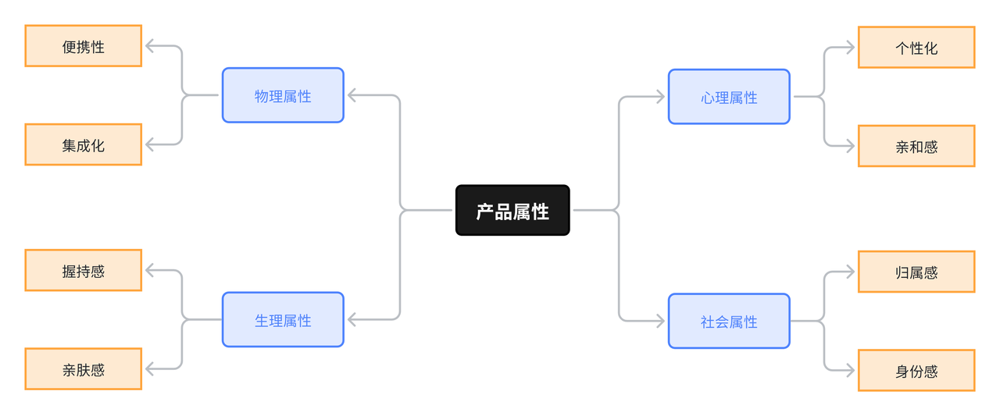
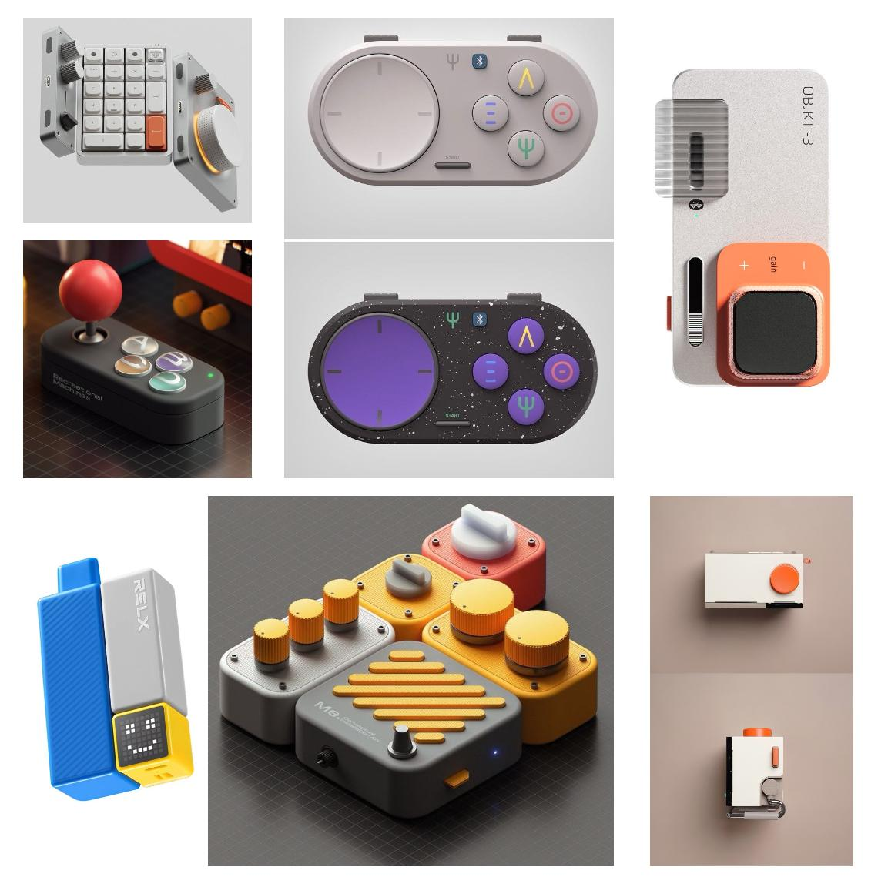

# 第二章：产品概念与意象转化

> 基于已收敛的问题定义（POV + HMW），完成产品概念的具象化定义，并通过意象图、关键词提取与AI生成工具，将抽象的设计语言转化为可视化的产品方向。

---

## 概述

经过第一章的认知唤醒与问题洞察，我们已经锁定了一个清晰的核心痛点（选项确认表），并完成了问题收敛（POV + HMW）。然而，这些问题定义仍然是文本层面的。本章的目标是将抽象的"问题-用户-需求"转化为具体的产品概念，并进一步将无形的"产品气质"转化为可视化的设计意象。

本章包含两个核心环节：

1. **产品定义**：将问题收敛成果转化为一份结构化的产品定义表，明确产品的定位、场景、功能、属性与语义。

2. **意象转化**：通过意象图收集、关键词提取与AI概念生成，将抽象语义（如"直觉""克制"）转化为具象的产品形态、材质与风格。

完成本章后，你将拥有一个明确的产品定义和多个可视化概念方向，为后续的原型设计奠定基础。

---

## 2.1 产品定义

产品定义是将问题收敛阶段得到的POV和HMW，转化为一个具体、可描述、可评估的产品概念。它回答了"我们要设计什么"的问题。

产品定义通常包含以下几个核心要素：

- **产品定位**：一句话说清楚"这是什么产品，为谁解决什么问题"
- **使用场景**：该产品在什么时间、地点、情境下被使用
- **核心功能**：为了实现设计目的，产品必须具备的1-3个关键功能
- **产品属性**：从功能、可用性、审美、符号四个维度描述产品特征
- **语义定义**：用3-5个形容词概括产品的气质，为后续视觉设计锚定方向

产品定义是连接"问题空间"与"方案空间"的桥梁。定义越清晰，后续的概念生成与原型设计就越有依据。

---

### 2.1.1 使用场景

使用场景分析是从"用户为中心"出发，描绘产品在实际生活中被使用的典型情境。本阶段需要跳出个人经验，通过观察、访谈或移情思考，探索更广泛用户的使用情境。场景特征可以从环境类型、用户行为模式、核心需求等维度进行归纳，形成对产品适用范围的清晰认知。明确场景特征有助于验证功能必要性，并发现不同场景下的设计侧重点。

我们针对Vibe Coding键盘的使用场景进行了分类：

| 场景类型 | 特征 |
|----------|------|
| 创客工作室 | 多设备协同、高强度创作、强个性化桌面 |
| 移动办公场所 | 空间有限、高频收纳、临时搭建工作环境 |
| 社交交流场所 | 团队讨论、内容展示、AI协同创作 |
| 固定办公工位 | 长时间陪伴、高频使用、桌面生态融合 |

---

## 📝 学习者任务六：用户使用场景探索

**任务**：为你的产品定义2-3个典型使用场景及其特征，跳出自身，至少构想不同用户（例如不同职业、不同年龄段或不同使用习惯）在什么情况下会使用你的产品。

**产出**：一段文字描述，清晰列出2-3个场景及其核心特征。

---

### 2.1.2 产品属性

本产品所针对的产品属性：

**💭 思考问题**

"为什么有人愿意花很高的价格买机械键盘？它满足了哪些非物理属性的需求？"

---

## 📝 学习者任务七：产品属性定义

**任务**：基于产品定义，为你的设计方向完成四维属性定义。

**属性关键词头脑风暴**：

针对每个维度，进行梳理：
- **功能**：[关键词]
- **可用性**：[关键词]
- **审美**：[关键词]
- **符号**：[关键词]

---

### 2.1.3 语义定义

语义定义是将产品属性转化为可沟通、可感知的设计语言。它回答了"用户会用哪三个词向朋友描述我的产品"。语义定义通常包含以下层次：

1. **核心语义**：用一个最精准的词概括产品的灵魂（如"随心""伴侣""利器"）。

2. **支撑语义**：用3个左右的词从不同角度支撑核心语义（如"直觉、克制、可靠"）。

3. **设计词典（可选）**：将每个语义词转化为具体的设计参数或判断标准，例如"克制" → 语音键不设独立背光，或长按时间需 >0.5 秒。

语义定义是连接"产品属性"与"意象转化"的桥梁。清晰的语义能够指导后续的造型、材质、色彩等设计决策，确保设计语言的一致性。

**引导提问**：

> "如果用三个形容词向朋友描述你的产品，你会选哪三个？这三个词就是你的核心语义。"

---

## 📝 学习者任务八：从属性到语义

**任务**：基于产品属性定义，完成从"属性"到"语义"的转化。

**核心语义提炼**

从产品属性优先级中提炼1个核心语义词和3个支撑语义词。

**模板**：

> "这款Vibe Coding键盘的【核心语义】是：______。它通过【支撑语义1】、【支撑语义2】、【支撑语义3】三个维度来体现。"

**示范**：

> "这款Vibe Coding键盘的核心语义是：创作伴侣。它通过克制（不喧宾夺主）、敏捷（操作一步直达）和温润（触感与视觉亲和）三个维度来体现。"

**设计词典构建**

将每个语义词转化为具体的设计参数或判断标准。

---

## 📝 学习者任务九：产品定义

**任务**：为你的设计课题完成产品定义，基于POV和HMW及上述使用场景、产品属性与语义定义填写一份完整的产品定义表。注意：产品定位必须具体，避免"一款优秀的产品"等空泛表述。

**产出**：以表格或思维导图的形式产出以下内容。

| 要素 | 内容 |
|------|------|
| 产品定位 | （一句话说清楚：为谁？解决什么问题？） |
| 使用场景 | （列出2-3个典型场景） |
| 核心功能 | （列出1-3个最必要的功能） |
| 产品属性 | 功能：（关键词）；可用性：（关键词）；审美：（关键词）；符号：（关键词） |
| 语义定义 | 核心语义：（一个词）；支撑语义：（三个词） |

---

## 🔧 工具卡3：产品设计蓝图绘制指南

*此指南帮助您从多个维度具象化你的产品概念。*

| 维度 | 内容 | 示例 |
|------|------|------|
| **活跃舞台** | 产品在用户生活中的角色 | Vibe Coding键盘是创作者的"智能助手" |
| **核心功能** | 产品的核心价值点 | 一键语音输入、AI快捷键、触觉反馈 |
| **气质感受** | 产品传递的情感体验 | 克制、敏捷、温润 |
| **用户旅程** | 用户与产品互动的完整流程 | 打开→连接→使用→收纳 |
| **关键触点** | 用户与产品交互的关键时刻 | 首次唤醒、日常使用、故障处理 |

---

## 🔧 工具卡4：语义定义与转化

*此工具帮助您将抽象的气质转化为可沟通、可执行的设计语言。*

### 语义定义的三个层次

| 层次 | 说明 | 示例 |
|------|------|------|
| **核心语义** | 产品的灵魂，最精准的一个词 | 创作伴侣 |
| **支撑语义** | 从不同角度支撑核心语义的3个词 | 克制、敏捷、温润 |
| **设计词典** | 将语义转化为具体设计参数 | 克制 → 无独立背光 |

### 语义-属性关联矩阵（示例）

| 语义 | 功能属性 | 可用性属性 | 审美属性 | 符号属性 |
|------|----------|------------|----------|----------|
| 克制 | 功能聚焦 | 操作简化 | 简约造型 | 低调配色 |
| 敏捷 | 响应快速 | 交互流畅 | 轻盈形态 | 动态反馈 |
| 温润 | 触感舒适 | 反馈温和 | 柔和材质 | 亲和视觉 |

---

## 🔄 多元视角验证（一）

完成"产品设计蓝图"后，邀请课程群中至少3位背景不同的伙伴（也可小队内互相帮助），向他们展示蓝图并收集反馈。

单一视角容易产生盲点，多元视角能帮助我们发现隐藏的问题，激发新的灵感，让设计基础更加稳固。请记录他们的主要观点，并思考如何整合这些不同视角，优化设计方向。

---

## 2.2 意象转化

通过"意象提取-语言转译-概念生成"的流程，将抽象的产品气质与视觉感受，借助AI图像工具逐渐转化为具有真实产品属性的设计方向。

---

### 2.2.1 意象选取

**灵感来源**：Pinterest、Dribbble、花瓣网。

选取相似产品的意象图如下，共性意象关键词：圆润、极简、科技感、精致、模块化、未来感。

---

## 📝 学习者任务十：意象图与关键词提取

### 意象图收集

- 在Pinterest/Dribbble/花瓣网搜索与你的设计方向相关的产品意象图
- 收集15-20张能代表你心中"理想产品气质"的图片
- 范围可以超出键盘品类（建筑、家具、汽车、电子产品均可）

### 关键词提取与聚类

- 为每张图标注1-3个感受关键词
- 统计所有关键词出现频次
- 筛选出Top 5核心关键词作为设计方向锚点

---

### 2.2.2 语言转译

本课程采用：

- Chat GPT image 2
- Nano banana PRO

进行AI产品概念生成。

通过意象参考图输入模型，结合提示词确定产品：
- 材质倾向
- 风格方向
- 个性化关键词

---

### 2.2.3 概念生成

## 📝 学习者任务十一：AI概念生成

**任务**：基于意象的关键词和属性定义，使用任一生图工具生成至少3个不同方向的Vibe Coding键盘概念图。

**输出要求**：

每个概念包含：

1. **概念名称**（如"Flow磁吸键盘"、"Orbit语音模块"）
2. **核心关键词**（3-5个）
3. **完整提示词**（中英文均可，需记录）
4. **概念图**（1-2张）

**方向建议**（可选择一个进行探索）：

- **方向A**：极致轻薄/移动优先（偏向便携场景）
- **方向B**：模块化/可重组（偏向个性化桌面）
- **方向C**：情感化/陪伴感（偏向心理体验）
- **方向D**：专业化/功能导向（偏向效率场景）

---

## 📝 灵感实验室：从关键词到视觉原型

### 第一步：构建灵感共鸣板

1. 在Pinterest、花瓣网等平台，广泛搜索与您的"设计语言"（形容词）相关的图片（建筑、家具、艺术品、科技产品等）。收集15-20张能引发"就是这种感觉！"共鸣的图片。

2. 为每张图标注1-3个感受关键词（如"流动的线条"、"温暖的木质"）。

3. 统计所有关键词，找出出现频率最高的3-5个词，作为 **"视觉密码"**。

**友情链接**：
- https://huaban.com/
- https://www.zcool.com.cn/

### 第二步：感官想象与内在化

闭上眼睛，想象理想中的产品就在面前。尝试回答：

- **触觉**：它的表面是什么温度？什么纹理？（是冰凉金属的理性，还是温暖木质的亲和？）
- **听觉**：操作它时，会发出什么声音？（是清脆的"咔嗒"声，还是静默的流畅感？）
- **嗅觉**：它会有气味吗？（是新电子产品的淡淡气味，还是天然材料的清香？）
- **情感**：触摸和使用它时，你内心最希望感受到哪种情绪？（是专注的平静，还是创造的兴奋？）

将你的感受记录下来，这些将丰富你的"视觉密码"。

### 第三步：召唤视觉原型

1. **组合提示词**：将"产品类型"、"核心/支撑语义词"、"视觉密码"及"感官想象"中的关键词，组合成给AI生图工具的"描述咒语"。

   例如：`"一个具有[温润]和[克制]气质的[智能键盘模块]，设计灵感来源于[流动的线条]，触感[细腻微凉]，整体风格[极简]、[未来感]。"`

   **友情链接**：
   - https://chat.openai.com
   - https://google.com/gemini

2. **生成与迭代**：使用提示词生成图像，并调整描述进行多轮生成，获得3-5张在不同方向上令您惊喜的"视觉原型"图。

3. **命名与记录**：为每个概念方向命名（如"磐石"、"流萤"），并记录最终使用的提示词。

---

## 🔄 概念快速验证：简易原型测试

选择最满意的两个"视觉原型"概念，用纸板、黏土或任何手边材料，在10分钟内制作一个能表达其**核心交互或形态特征**的简易实体模型。向一位朋友（不一定是设计背景）展示，并只用1分钟解释："这是一个为解决[Who的核心问题]而设计的[产品]，它的特点是[XXX]。"观察他们的第一反应，并询问一个简单问题："你觉得它可能怎么用？"记录反馈。这个快速测试能验证概念是否被直观理解，是想法落地前的重要试炼。

---

## 📝 学习者任务汇总

完成第二章后，你将产出：

1. 一份"灵感共鸣板"（图片集+关键词统计）
2. 一份"感官想象"记录
3. 一组（3-5张）"视觉原型"图及说明
4. "简易原型测试"的记录与反思

---

## 🔄 阶段回顾与心态调整（二）

完成第二章所有任务后，进行阶段性回顾。

**1. 回顾与检视**：回顾从"战略地图"到"视觉原型"的整个旅程。你的产品定义是否始终回应了最初的POV？在"长远考量"和"价值锚点"的思考中，你对"好设计"的理解是否有新的维度？简易原型测试带来了什么新启发？

**2. 心态与展望**：为在整个探索过程中获得的每一个灵感、每一次突破、甚至每一个挫折而珍视。真正的创造源于深刻的洞察、持续的努力以及对用户和世界的一份责任感。带着这些收获，准备进入下一阶段的深化设计。

---

<a href="/VC-Lab/chapter3/" class="learn-more-btn">继续学习第三章</a>

  <label class="bb8-toggle" title="Toggle theme">
    <input type="checkbox" class="bb8-toggle__checkbox" />
    

      

      

      

      

      

      

      

      

        

          

            

            

          

        

        

      

      

      

        

        

        

      

    

  </label>

  <svg viewBox="0 0 24 24" fill="none" stroke="currentColor" stroke-width="2">
    <path d="M12 19V5M5 12l7-7 7 7" stroke-linecap="round" stroke-linejoin="round"/>
  </svg>

