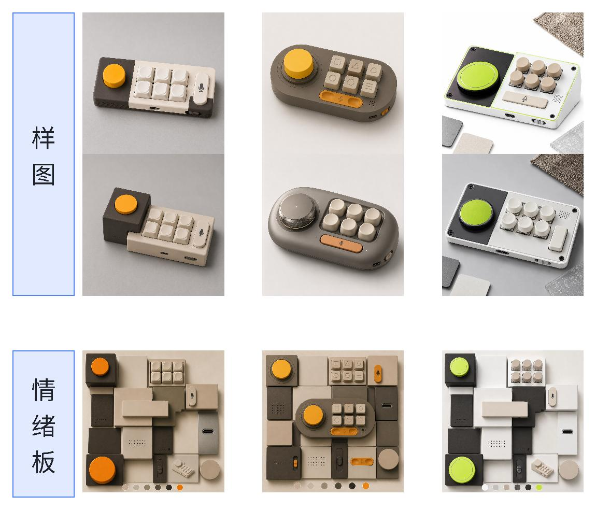

# 第三章：概念深化与成果交付

> 将前期的视觉概念深化为完整的产品提案，并通过故事板的形式呈现最终设计成果。

---

## 概述

经过前两章的学习，您已经完成了：
1. 问题洞察与收敛（POV + HMW）
2. 产品定义与语义转化
3. AI视觉概念生成

本章将引导您完成：
1. **概念深化**：从多个视觉原型中选择最优方向进行深化
2. **方案评估**：建立评估标准，筛选最佳概念
3. **故事板制作**：将概念转化为完整的产品故事

---

## 3.1 概念深化

从前期生成的3-5个视觉原型中，选择最有潜力的两个方向进行深化。深化过程包括：

1. **功能细化**：明确产品的具体功能点和交互方式
2. **形态优化**：完善产品的外观设计和细节处理
3. **材质选择**：确定产品的材质和色彩方案
4. **场景适配**：确保产品在不同使用场景下的适用性

---

## 📝 学习者任务十二：概念深化

**任务**：选择两个最有潜力的视觉原型，进行深度发展。

**产出**：
- 每个概念的详细功能描述
- 产品形态的细化草图或渲染图
- 材质和色彩方案说明
- 关键交互场景描述

---

## 3.2 方案评估

建立评估标准，对深化后的概念进行客观评估，筛选出最终方案。

### 评估维度

| 维度 | 说明 | 权重 |
|------|------|------|
| **用户价值** | 解决用户痛点的程度 | 30% |
| **创新性** | 与现有解决方案的差异程度 | 20% |
| **可行性** | 技术实现的难度和成本 | 20% |
| **美观性** | 视觉设计的质量和协调性 | 15% |
| **商业价值** | 市场潜力和盈利可能性 | 15% |

### 评估矩阵

| 概念 | 用户价值 | 创新性 | 可行性 | 美观性 | 商业价值 | 总分 |
|------|----------|--------|--------|--------|----------|------|
| 概念A | | | | | | |
| 概念B | | | | | | |

---

## 📝 学习者任务十三：方案评估

**任务**：使用评估矩阵对您的概念进行评分，选择最终方案。

**产出**：
- 完整的评估矩阵
- 选择理由说明
- 最终方案的定位陈述

---

## 3.3 故事板制作

故事板是将产品概念转化为可视化故事的有效工具。它通过一系列画面展示产品的使用场景、核心功能和用户体验。

### 故事板大纲

**第1页：封面**
- 项目名称
- 你的姓名
- 日期

**第2页：问题引入**
- 用户画像
- 核心痛点
- 设计课题

**第3页：设计战略**
- HMW问题
- POV陈述
- 洞察发现

**第4页：解决方案**
- 产品蓝图
- 核心功能

**第5页：视觉概念**
- 概念图展示
- 设计说明

**第6页：体验展望**
- 使用场景描述
- 用户旅程

**第7页：总结**
- 项目亮点
- 学习收获

---

### 🎨 样图和情绪板示例

以下是样图和情绪板示例，展示了如何将抽象概念转化为视觉语言：

---

## 📝 学习者任务十四：概念故事板

**任务**：制作完整的产品概念故事板。

**产出**：
- 7页完整故事板（可使用PPT、Figma或手绘）
- 每个页面的详细说明
- 整体设计风格统一

---

## 3.4 成果展示与分享

完成故事板后，准备向课程群中的伙伴展示您的设计成果。

### 展示要点

1. **问题陈述**：清晰说明您解决的核心问题
2. **设计亮点**：突出产品的创新点和价值
3. **视觉呈现**：通过故事板展示完整体验
4. **反思总结**：分享学习过程中的收获和挑战

### 反馈收集

邀请伙伴从以下角度提供反馈：
- 问题定义是否清晰？
- 解决方案是否有效？
- 视觉设计是否吸引人？
- 是否有改进建议？

---

## 🔄 阶段回顾与心态调整（三）

完成第三章所有任务后，进行最终的阶段性回顾。

**1. 回顾与检视**：回顾从"问题发现"到"概念交付"的整个旅程。你的设计是否始终回应了最初的用户需求？在整个过程中，哪个环节给你带来最大的挑战？哪个洞察让你最有成就感？

**2. 心态与展望**：设计是一个持续迭代的过程。即使完成了本次课程，你的设计之旅才刚刚开始。保持好奇心和开放心态，继续观察生活中的问题，不断探索和创造。

---

## 🎉 课程结业

恭喜您完成了"设计课程第一期"的全部学习内容！

### 您的学习成果

通过本课程，您完成了：
1. ✅ **问题洞察**：掌握了从模糊感觉中发现问题的方法
2. ✅ **双钻模型**：学会了从发散到收敛的思维方式
3. ✅ **产品定义**：掌握了如何将问题转化为具体产品概念
4. ✅ **意象转化**：学会了使用AI工具辅助视觉概念生成
5. ✅ **概念交付**：能够用故事板形式呈现完整设计方案

### 核心产出

您的最终成果包括：
- 痛点地图（不少于5个具体痛点）
- 课题定义书
- POV陈述 + 3个HMW问题
- 产品设计蓝图
- AI视觉概念图（3-5个方向）
- 概念故事板

### 继续探索

设计是一个终身学习的过程，建议您：
1. 持续观察生活中的设计问题
2. 尝试将学到的方法应用到实际项目中
3. 关注设计趋势和新技术
4. 加入共创，与其他小伙伴深入交流，一起成长

---

<a href="/VC-Lab/" class="learn-more-btn">返回首页</a>

  <label class="bb8-toggle" title="Toggle theme">
    <input type="checkbox" class="bb8-toggle__checkbox" />
    

      

      

      

      

      

      

      

      

        

          

            

            

          

        

        

      

      

      

        

        

        

      

    

  </label>

  <svg viewBox="0 0 24 24" fill="none" stroke="currentColor" stroke-width="2">
    <path d="M12 19V5M5 12l7-7 7 7" stroke-linecap="round" stroke-linejoin="round"/>
  </svg>

